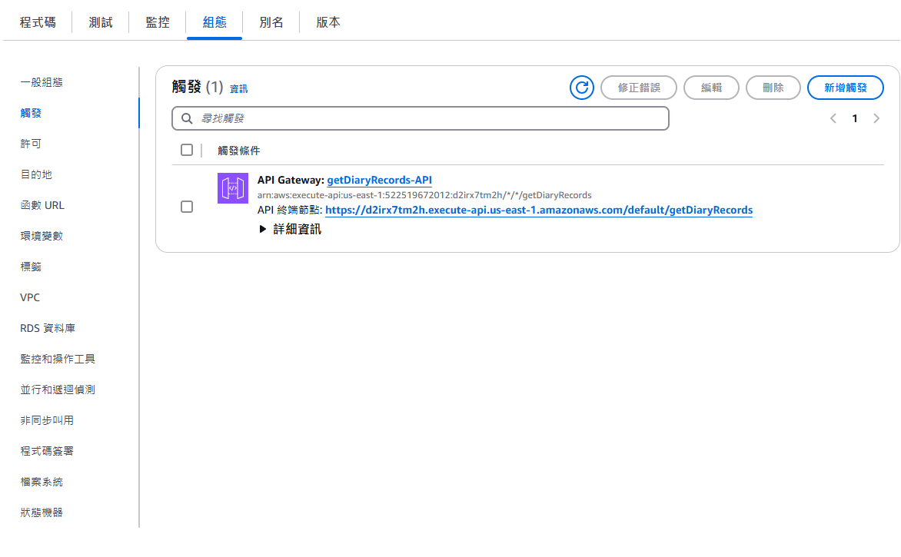
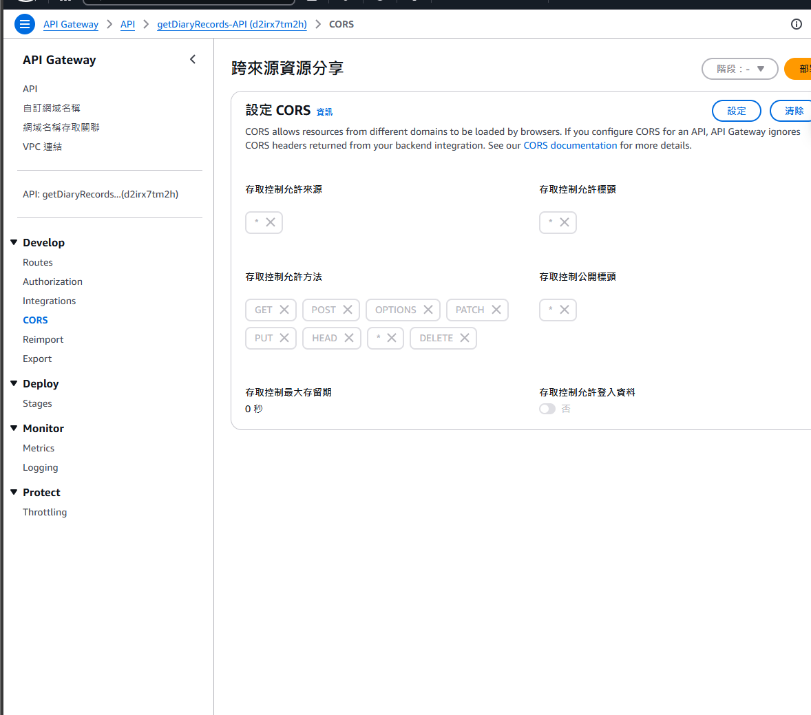

Lambda 上建立新的函數
並將index.mjs複製上去
TOKEN要改成自己的資料庫
然後部署

並設定觸發條件選擇api gateway
創新的api gateway 選擇 http
創完之後如以下截圖複製底下api終端節點，並點入api gateway名稱，選擇側邊攔cors，把所有都打*

把剛剛複製的api節點放入
LifeLens\life-lens-frontend\src\pages\Dashboard.js 110行位置的地址

